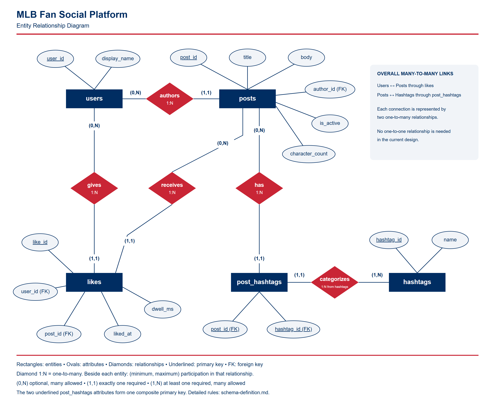

# MLB Fan Social Platform Database

A relational database design for a platform where Major League Baseball fans share short posts, give likes, and organize discussions with hashtags.

**Theme:** Social Media — Major League Baseball  
**Author:** [RainerAlvarado](https://github.com/RainerAlvarado)  
**Course:** EX603 Data and Algorithms for Scalable Systems, Boston University  
**Status:** Relational design completed; SQL implementation and queries will follow.

## Domain

This platform gives baseball fans a place to share reactions to games, discuss teams and players, and find posts about topics that interest them. Each registered user has a unique display name and can write posts with a title and a body of up to 280 characters. Users can like a post once and attach optional hashtags such as `#OpeningDay` or `#RedSox` to their own posts. The database models these activities through five relations: `users`, `posts`, `likes`, `hashtags`, and `post_hashtags`.

The platform needs to answer practical questions about its content and connections. Which posts did a particular user write? Which active posts use a selected hashtag? Which posts are shorter than a given character limit? Who liked a post, and which posts has a user liked? It must also identify posts with no likes or hashtags without dropping them from results simply because those connections are missing.

The interaction data will support questions such as which posts receive the most likes, how many likes occur during a selected period, and how long users view a post before liking it. Each like records its timestamp and `dwell_ms`, the viewing time in milliseconds during that visit before the like. This metric describes visits that result in likes, rather than all viewing activity. The design represents current retained content: deleting an account removes its posts and likes, and a hashtag is removed when no posts use it. Analysis of deleted activity would require a separate historical-data design.

## Entity Relationship Diagram

The diagram uses rectangles for entities, ovals for attributes, underlined primary keys, and diamonds for relationships. It shows both relationship types and minimum/maximum participation. See the [diagram guide](schema/erd-guide.md) for a walkthrough.

Editable sources: [Mermaid model](schema/erd.mmd) · [Arranged vector diagram](schema/erd.svg).

## Design Documentation

- [Schema definition](schema/schema-definition.md) — all five relations, attributes, domains, and primary keys.
- [Integrity constraints](schema/constraints.md) — validation rules, foreign keys, deletion policies, and hashtag cleanup.
- [Modeling justification and reflection](analysis/unit1.md) — the reasoning behind the design and its tradeoffs.

